<h1 align="center">Hi, I'm Rajesh Ravi Sohani 👋</h1>

<h3 align="center">Final Year CS Engineer &nbsp;|&nbsp; Java Full Stack &nbsp;|&nbsp; AI/ML &nbsp;|&nbsp; Building LLMs from Scratch</h3>

 

## About Me

- 🎓 Final Year **B.TECH. Computer Engineering** student
- 💼 **Java Full Stack Intern** at Cyber Success Deccan *(via Campus Connect)*
- 🏆 Selected for **Data Science Internship** at Plexus Skills Pvt. Ltd., Pune *(via Campus Connect)*
- 🤖 Currently building a **GPT-style LLM from scratch**
- 📐 Learning **System Design**
- 📜 Completed **Diploma in Computer Engineering**
- 🧠 Completed **AIML Short Course** at Pregrade
- 📅 Practicing **DSA daily** in Java

---

## 🛠️ Skills

**Languages**

**AI / ML**

**Concepts**

---

## 🚀 What I'm Building

- 🧠 **GPT-style LLM from Scratch** — Building a transformer-based language model from ground up to deeply understand how LLMs work internally
- 📐 **System Design** — Learning scalable system architecture, databases, caching, load balancing and distributed systems

---

## 📌 Featured Projects

| Project | Description | Tech |
|---------|-------------|------|
| [dsa-daily-practice](https://github.com/rajeshsohani53/dsa-daily-practice) | Daily DSA problem solving — Two Pointer, Sliding Window, Sorting, KMP and more | Java |
| [Doc-qa-rag](https://github.com/rajeshsohani53/Doc-qa-rag) | Document Q&A system using Retrieval Augmented Generation (RAG) | Python |
| [weekly-report-system](https://github.com/rajeshsohani53/weekly-report-system) | AI-powered weekly developer report generator | Python, LangChain |

---

## 📊 GitHub Stats

  

  

  

  

  

---

## 📫 Connect with Me

---

  

